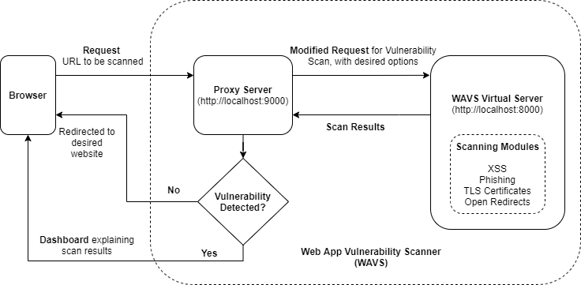
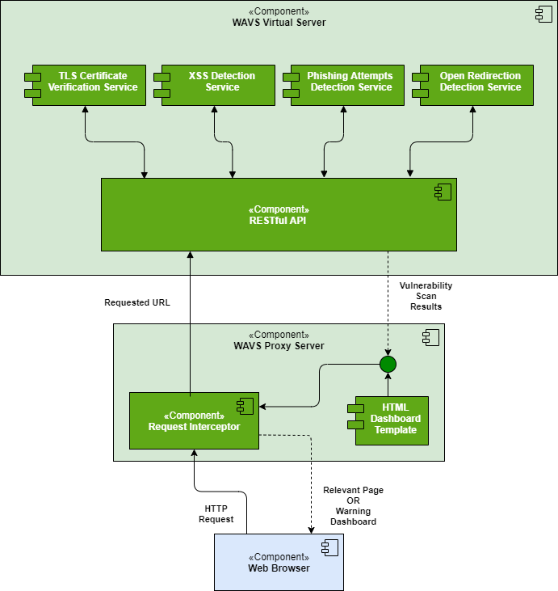
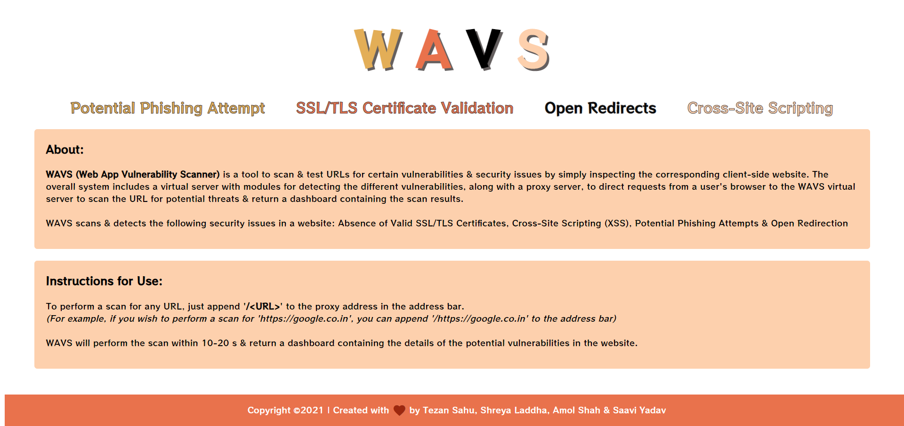
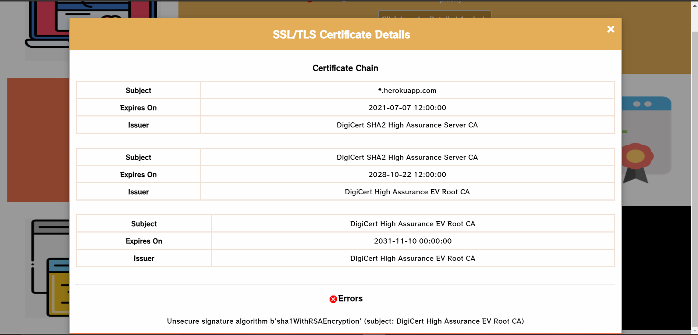
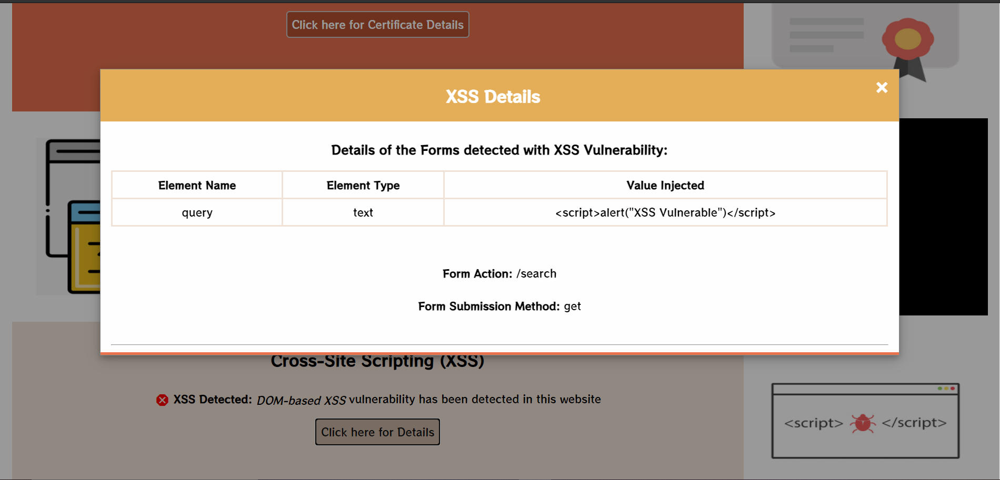

# WAVS: Web App Vulnerability Scanner 

### Course Project for CS416 (Foundations of Network Security and Cryptography)

## Overview

WAVS (Web App Vulnerability Scanner) is a tool to scan & test URLs for certain vulnerabilities & security issues by simply inspecting the corresponding client-side website. The overall system would include a virtual server with modules for detecting the different vulnerabilities, along with a proxy server, to direct requests from a browser to the virtual server first while visiting a website. The proxy could warn the user before redirecting to the website if some vulnerabilities are found during the scan done by our virtual server.



We intend to identify & assess the following security issues that a website may suffer from:

- Absence of Valid TLS Certificates
- Cross-Site Scripting (XSS)
- Potential Phishing Attempts
- Open Redirection

## System Architecture



## Usage

1. Fire up a terminal, clone this repository using `git clone https://github.com/tezansahu/WAVS.git` & `cd` into it

2. Start the WAVS server using the following steps _(Python 3 required)_:
   ```bash
   $ cd server
   $ pip install -r requirements.txt        # Install all the packages required for running the server
   $ python main.py
   ```
   This will start the WAVS virtual server at `https://localhost:9000`

3. Fire up another terminal & start the WAVS proxy using the following steps _(Node.JS required)_:
   ```bash
   $ cd proxy
   $ npm i          # Install the packages necessary to run the proxy
   $ node wavs_proxy.js
   ```
   This will start the WAVS proxy at `https://localhost:8000` with default settings (full scan). To start the proxy for a selective scan, use the following:
   ```bash
   # Perform only SSL/TLS Certificate checking & XSS detection
    $ node wavs_proxy.js --scan selective --tls_cert --xss

    # Perform only Phishing & Open Redirct detection
    $ node wavs_proxy.js --scan selective --phishing --open_redirect
   ```

4. Now open a browser & type `http://localhost:8000/` in the address bar. This will open up the WAVS landing page which should look as follows:

   


5. To perform a scan for any URL, just append `/<URL>` to the proxy address in the address bar. 

   For example, if you wish to perform a scan for `https://google.co.in`, the contents of the address bar should look like: `http://localhost:8000/https://google.co.in`

   WAVS will perform the scan within 10-20 s & return a dashboard containing the details of the potential vulnerabilities present in the website.

### WAVS Dashboard

After performing a scan, WAVS displays a dashboard containing details about the various vulnerabilities. Following are the results of a scan performed on `https://bugslayers-cs416-open-redirect.herokuapp.com/`


<div style="text-align: center;">

   

   


   
</div>


## Vulnerable (Dummy) Website

To demonstrate the full capacity of WAVS at once, we created a dummy website, withsome inherent vulnerabilities that WAVS can detect:

- **Open Redirect** vulnerability was introduced by allowing redirects to any URL if mentioned as the `?url=` query parameter in the address
- **Cross-Site Scripting** has  been  introduced  through  a  small  vulnerable  form,  which  allows JavaScript code input & executes it on the browser
- Since the website is recently deployed, & has very few backlinks, ranks low on PageRank & Alexa,it may be considered potentially **phishy** as well
- The certificate chain has some issue with the signature algorithm of one of the SSL certificates, hence the **SSL certificate** verification also fails

The website was developed using `express` (Node.js) & deployed on Heroku. It can be accessed at: https://bugslayers-cs416-open-redirect.herokuapp.com/


The code for this website can be found [here](https://github.com/tezansahu/WAVS/tree/main/vuln_site).
## Reports

- [**Final Report**](./reports/FinalReport.pdf)
- [Stage II Report](./reports/Stage2Report.pdf)
- [Detailed Proposal](./reports/Proposal.pdf)


***

<p align="center">Created with ❤️ by <a href="https://tezansahu.github.io" target="_blank">Tezan Sahu</a>, <a href="https://laddhashreya2000.github.io" target="_blank">Shreya Laddha</a>, <a href="https://www.linkedin.com/in/saavi-yadav-7ab61a151/" target="_blank">Saavi Yadav</a> & <a href="https://www.linkedin.com/in/amol-g-shah/" target="_blank">Amol Shah</a></p>
