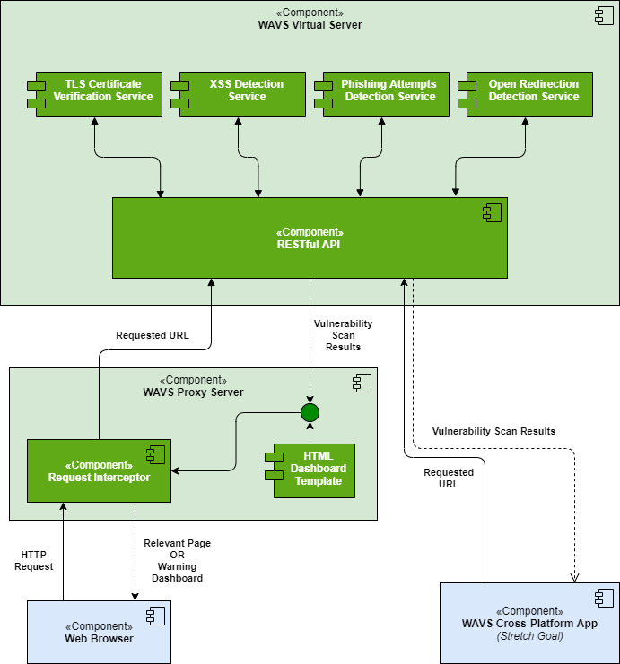

# WAVS: Web App Vulnerability Scanner 

### Course Project for CS416 (Foundations of Network Security and Cryptography)

## Overview

WAVS (Web App Vulnerability Scanner) is a tool to scan & test URLs for certain vulnerabilities & security issues by simply inspecting the corresponding client-side website. The overall system would include a virtual server with modules for detecting the different vulnerabilities, along with a proxy server, to direct requests from a browser to the virtual server first while visiting a website. The proxy could warn the user before redirecting to the website if some vulnerabilities are found during the scan done by our virtual server.

We intend to identify & assess the following security issues that a website may suffer from:

- Absence of Valid TLS Certificates
- Cross-Site Scripting (XSS)
- Potential Phishing Attempts
- Open Redirection

## [Detailed Proposal](./Proposal.pdf)

## System Architecture

***

Created with ❤️ by <a href="https://tezansahu.github.io" target="_blank">Tezan Sahu</a>, <a href="https://laddhashreya2000.github.io" target="_blank">Shreya Laddha</a>, <a href="https://www.linkedin.com/in/saavi-yadav-7ab61a151/" target="_blank">Saavi Yadav</a> & <a href="https://www.linkedin.com/in/amol-g-shah/" target="_blank">Amol Shah</a>

